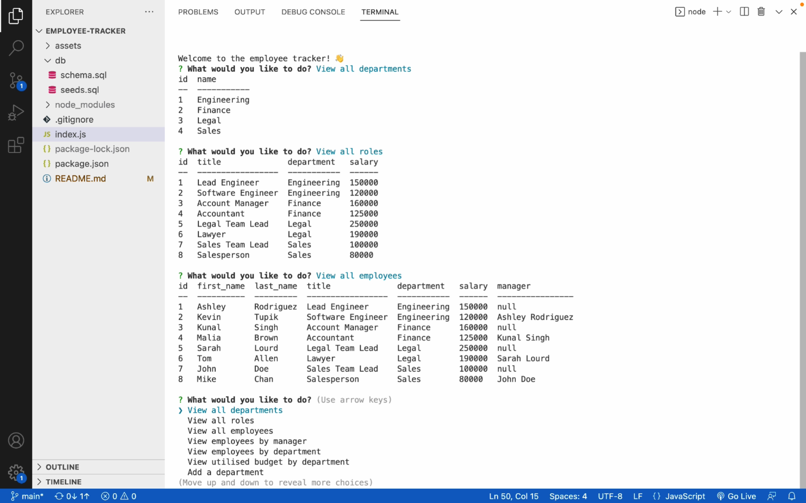

# employee-tracker

## Table of Contents

* [Description](#description)
* [Access](#access)
* [Installation](#installation)
* [Usage](#usage)
* [Credits](#credits)

## Description

My goal for this project was to create an application that allows the user to view and manage the departments, roles, and employees in a company. This would be helpful to a business owner who wants to organise and plan their business.

To achieve this, I used Javascript.



During this project, I consolidated my understanding of databases and MySQL. In particular, I re-inforced what I have learnt about:
- Data types
- Schema
- Seeds
- CRUD operations
- And, prepared statements.

## Access

To access the repository where the code is saved, click [here](https://github.com/hayleyarodgers/employee-tracker).

To access a video walkthrough tutorial of the application, click [here](./assets/walkthrough/employee-tracker-demo-HRodgers.mp4) to access it directly or [here](https://drive.google.com/file/d/1-nKOjfsTqBETIYKIJrcHNkmeO4j3uwJ8/view?usp=sharing) to access it via GoogleDrive.

## Installation

To install necessary dependencies, run the following command:

```
npm i
```

## Usage

To use the application:
1. Open the repository in your terminal or bash.
2. Log into MySQL by entering ```mysql -u root -p``` in the command line, using ```poiuytrewq1!``` as the password.
3. Create the database by entering ```SOURCE ./db/schema.sql;```.
4. (Optional) Seed the database with sample data by entering ```SOURCE ./db/seeds.sql;```.
5. Quit MySQL by entering ```quit```.
6. Start the application by entering ```node index.js```.
7. Use the application by answering the prompts.

## Credits

- I used the [MySQL2](https://www.npmjs.com/package/mysql2) package to connect to my MySQL database and perform queries.
- I used the [Inquirer](https://www.npmjs.com/package/inquirer/v/8.2.4) package to interact with the user via the command line.
- I used the [console.table](https://www.npmjs.com/package/console.table) package to print MySQL rows to the console.